## Framing

Estudio correlacional. Objetivo único: cuantificar en qué medida métricas de variabilidad y alineación de gradientes medidas en la fase inicial del entrenamiento predicen indicadores de eficiencia del entrenamiento completo. La componente de intervención (early stopping basado en la señal) queda explícitamente fuera del alcance del TFG por restricciones de tiempo. Puede mencionarse como trabajo futuro.

## Pregunta de investigación

¿Pueden métricas de variabilidad y alineación de gradientes, medidas en la fase inicial del entrenamiento, predecir la eficiencia del entrenamiento completo?

Sub-preguntas:
- **Métricas**: ¿qué métrica es estable y computacionalmente viable?
- **Resultado**: ¿predicen velocidad de convergencia o rendimiento final?
- **Robustez**: ¿se mantiene la relación across learning rates y optimizadores?
- **(Fuera de alcance, futuro)**: intervención basada en la señal (ej. ajuste dinámico de LR, early stopping).

## Hipótesis operativa

La variabilidad y/o alineación de los gradientes, medida a través de distintas métricas en una fracción inicial del entrenamiento, correlaciona significativamente con indicadores de eficiencia del entrenamiento completo, bajo variaciones de learning rate y optimizador, en arquitecturas de visión por computador.

Hipótesis falsada si las correlaciones son débiles (|ρ| < 0.3) o inestables entre configuraciones en la mayoría de condiciones. Un resultado negativo con análisis robusto sigue siendo contribución válida.

## Hipótesis a contrastar

Formalización falsable de la hipótesis operativa en seis contrastes, cada uno con su criterio:

- **H1 (existencia).** Al menos una métrica temprana de gradiente correlaciona con la eficiencia a |ρ| ≥ 0,3 dentro de la mayoría de condiciones. (Es la hipótesis operativa de arriba.)
- **H2 (valor incremental — la decisiva).** Al menos una métrica conserva poder predictivo *tras controlar por el baseline de loss* (TSE + `val-loss@f`): ΔR² > 0 / correlación parcial significativa. Si H1 se cumple pero H2 falla, las métricas de gradiente son redundantes con la señal gratis — negativo válido y no trivial.
- **H3 (qué familia gana).** Una de las dos familias (alineación vs variabilidad) es sistemáticamente más predictiva o más robusta. El título apuesta por alineación; pregunta empírica abierta (ligada al riesgo de coherencia título–contenido).
- **H4 (suficiencia temprana).** El poder predictivo satura pronto: ρ al 10% no es distinguible de ρ al 50% para las mejores métricas. Pago práctico: decidir antes.
- **H5 (invariancia cross-optimizador).** Como todas las métricas se computan sobre el gradiente bruto ∇L y nunca sobre el update preacondicionado, el signo de la correlación se preserva entre SGD y Adam. Consecuencia comprobable de la decisión "raw-grad".
- **H6 (mecanismo, con signo).** Cada métrica trae una predicción *con signo* de su paper: alta stiffness intra-clase, alta m-coherence y baja gradient confusion → convergencia más rápida; NGV/GNS altos → más lento o batch mayor; GWA alto → mejor generalización. Que el signo observado coincida con el predicho es prueba más exigente que la magnitud.

## Diseño experimental

### Variables dependientes (eficiencia del entrenamiento)

1. Número de épocas hasta alcanzar un umbral de accuracy predefinido por dataset (primaria). Runs que no alcancen el umbral se tratan como censurados.
2. Área bajo la curva de test loss dentro de un presupuesto fijo de épocas.
3. Mejor test loss alcanzada dentro de ese presupuesto (secundaria).

### Variables independientes (métricas tempranas)

El conjunto *computado* está implementado y fijado en código (`src/metrics/`, 8 métricas + baseline); la lista *reportada* se poda después por colinealidad con prueba (ver [[2 - Decisiones]]). Dos familias:

- **Alineación / coherencia direccional**: gradient confusion, stiffness, m-coherence, gradient disparity, GWA.
- **Variabilidad estocástica**: gradient noise scale, normalized gradient variance, GSNR.

Dos candidatas tempranas no aparecen como métricas separadas: la *cosine similarity entre gradientes de batches* queda subsumida (stiffness y gradient confusion se construyen sobre los cosenos por pares de gradientes per-ejemplo), y el *NTK alignment* se menciona como marco teórico pero no se computa (decisión 2026-06-09 en [[2 - Decisiones]]).

La lista se cierra antes de ejecutar los experimentos. No se añaden métricas a posteriori.

### Ventana temporal

Fracciones fijas del presupuesto total de entrenamiento. Barrido en 5%, 10%, 25%, 50%. El barrido en sí mismo es un resultado reportable (cuán temprano basta para predecir).

Cómo se mide en la práctica (`src/train.py`): las métricas se registran al final de *cada* época durante todo el entrenamiento, y además densamente (cada `metric_every_steps=100` pasos) dentro de la ventana temprana (`early_window_frac=10%` de los pasos totales). Los snapshots de 5/10/25/50/100% no se miden en el instante exacto: se eligen *a posteriori* de la trayectoria completa, tomando para cada fracción la época cuyo progreso sea más cercano (`metrics_at_window.parquet`). Con los presupuestos congelados (20/40/60/80 épocas, todos múltiplos de 20), el snap es exacto: cada fracción de `windows` cae justo en una frontera de época (0,05×20=1, 0,25×60=15, etc.), así que no hay desfase entre fracción nominal y época elegida. Las filas densas de la ventana temprana no alimentan estos snapshots, pero quedan en `trajectory.parquet`: si el análisis pidiera ventanas por debajo del 5% (1–2%), bastaría extender el snap a posteriori sin relanzar ningún run.

### Setup de entrenamiento

- Datasets: MNIST, CIFAR-10, CIFAR-100, Tiny-ImageNet. Núcleo decidido 2026-05-14; Tiny-ImageNet confirmado 2026-06-09 (ver [[2 - Decisiones]]).
- Normalización: media/desviación por canal del *training set* de cada dataset, sin augmentation (estudio sensible al determinismo). Constantes verificadas por recálculo desde cero (2026-06-09): MNIST/CIFAR-10/CIFAR-100 coinciden a <5e-5. **Caveat de reproducibilidad:** Tiny-ImageNet coincide solo a ~6e-4 (media exacta, std algo menor en los tres canales); el desfase es consistente con la decodificación JPEG (versión de libjpeg/Pillow), así que su normalización exacta depende del entorno — fijar versiones si se quiere reproducir bit a bit.
- Arquitecturas: FC, CNN simple, ResNet-18. Familia decidida 2026-05-14; variante ResNet-18 fijada 2026-06-09.
- Label noise: descartado en v1. Backlog si sobra tiempo (replicaría Forouzesh / Chatterjee&Zielinski).
- Learning rates: varios por condición (rejilla concreta en §Matriz de runs).
- Optimizadores: SGD y Adam.

### Matriz de runs (congelada 2026-06-09)

Rejilla completa: cuatro datasets × tres arquitecturas × dos optimizadores = **24 celdas** (celda = dataset × arquitectura × optimizador, la unidad del objetivo n ≥ 30 de §Riesgos abiertos #1). Decisión y justificación en [[2 - Decisiones]].

- **Profundidad.** 8 LR × 5 seeds = 40 runs por celda → **~960 runs**, por encima del suelo n ≥ 30. La dispersión del predictor la dan los LR, no las seeds; de ahí que se priorice el nº de LR. Seeds compartidas {0,1,2,3,4} en todas las celdas para comparación pareada entre SGD y Adam (H5).
- **Rejilla de LR (log-espaciada en medias décadas, por optimizador — no por modelo).** 8 puntos por optimizador, la misma rejilla para FC, CNN y ResNet-18 (decisión 2026-06-09 en [[2 - Decisiones]]). SGD (momentum 0,9): `{3e-4, 1e-3, 3e-3, 1e-2, 3e-2, 1e-1, 3e-1, 1.0}`. Adam: `{3e-5, 1e-4, 3e-4, 1e-3, 3e-3, 1e-2, 3e-2, 1e-1}` (misma forma, desplazada una década abajo porque su paso efectivo va preescalado por 1/√v). El rango ancho (3,5 décadas) cubre los óptimos de las tres arquitecturas sin lógica por modelo; los extremos divergen o no alcanzan umbral por diseño — los runs censurados pueblan el eje de eficiencia (VD1). El centro se recalibra tras el pilot si el óptimo de alguna celda cae descentrado.
- **Hiperparámetros fijos (no se barren, para no añadir confusores).** `batch_size=128`, `weight_decay=0`, `momentum=0.9` (SGD) / betas por defecto (Adam), `probe_size=256`, `metric_every_steps=100`, `early_window_frac=0.10`, `windows=[0.05, 0.10, 0.25, 0.50, 1.0]`. Las métricas leen ∇L de la pérdida (no el paso preacondicionado), así que el weight decay no entra en su valor; se fija a 0 sólo para no introducir un eje de trayectoria extra.
- **Presupuesto y umbral por dataset** (puntos de partida, se calibran en el pilot; sin data augmentation → por debajo del SOTA): MNIST 20 épocas / umbral acc 0,97; CIFAR-10 40 / 0,75; CIFAR-100 60 / 0,35; Tiny-ImageNet 80 / 0,25. FC sobre CIFAR-100 y Tiny-ImageNet apenas aprende: esas celdas quedan censuradas en VD1 y se sostienen sobre las VD secundarias (AUC de test-loss, best-loss).
- **Métricas.** Se computa el conjunto completo de métricas implementadas en toda la rejilla (en ResNet-18, las per-sample van last-layer-only). La lista *reportada* se poda luego por colinealidad con prueba (ver [[2 - Decisiones]]).

### Baselines

El baseline no es la métrica más simple ni la que diga el paper: es *el mejor predictor obtenible sin instrumentar el gradiente*. Lo que da valor al estudio es el coste de medir el gradiente, así que el rival a batir es lo que se obtiene gratis de la curva de loss. Tres niveles:

- **Nivel 0 — sin gradiente (suelo).** TSE (suma o EMA de las train loss tempranas; coste cero, estándar en NAS) y, sobre todo, **`early-val-accuracy@f`** (val accuracy/loss medida en la misma fracción $f$). Este último es un predictor fortísimo y casi gratis: si las métricas de gradiente no lo baten, no hay aporte que defender.
- **Nivel 1 — gradiente barato (benchmark interno).** Normalized variance (NGV) y gradient noise scale (GNS) en variabilidad; gradient disparity en alineación (Pearson 0,957 con test error sobre 220 configuraciones en Forouzesh & Thiran). Es el rival a batir para justificar una métrica de gradiente *cara*.
- **Nivel 2 — retadoras.** Las caras o novedosas (gradient confusion, m-coherence, stiffness, GSNR, GWA) deben superar a los niveles 0 y 1. GWA es barato y a la vez el de mayor correlación reportada en la literatura (Pearson 0,99 en Hölzl 2025): si una métrica barata domina a las caras, el titular es *no hace falta instrumentación cara*.

El entregable más vendible no es "quién predice mejor" sino "quién predice mejor por unidad de coste": un **frente de Pareto** potencia-predictiva vs coste, no un único ganador.

## Procedimiento

```mermaid
flowchart LR
    A["Preparar datos\nMNIST / CIFAR-10 / CIFAR-100"] --> B["Entrenar modelos\nFC, CNN simple, ResNet"]
    B --> C["Logging métricas alineación + variabilidad\npor batch/época"]
    C --> D["Registrar eficiencia\n(épocas-a-umbral, AUC, best loss)"]
    D --> E["Barrido ventana temprana\n5% / 10% / 25% / 50%"]
    E --> F["Correlación Spearman + Pearson\ncon corrección FDR"]
    F --> G["Análisis robustez\ncross arch × dataset × LR × optimizador"]
    G --> H["Resultados y conclusiones"]
```

### Ejecución y reanudación

`src/run_matrix.py` es la fuente única de verdad de la rejilla. `--init` genera los 24 YAML de celda en `experiments/` (presupuesto por dataset + knobs congelados; los ficheros existentes no se tocan, así sobreviven ediciones a mano tras el pilot). LR y seed no van en los YAML: son los ejes de barrido y se inyectan por run, de modo que el nombre del run queda determinado por (modelo, dataset, optimizador, lr, seed). Un run cuenta como *hecho* si existe `reports/<run_name>/summary.json` — `train.py` lo escribe en último lugar, así que su presencia marca un run completo. El lanzador es idempotente: relanzarlo ejecuta solo los pendientes (reanudación tras caídas del cluster sin contabilidad externa), y los flags `--dataset/--model/--optimizer` permiten trocear la rejilla entre nodos.

Antes de la matriz va el pilot de calibración: `src/run_pilot.py` ejecuta un run por celda (LR centrado, seed 0, presupuesto doblado) escribiendo en `reports_pilot/` para no colisionar con la detección de reanudación de la matriz, y `--report` resume la evidencia para fijar presupuestos y umbrales definitivos. Protocolo y justificación en [[2 - Decisiones]].

## Protocolo de análisis

- Correlaciones Spearman (primaria) y Pearson (secundaria) entre cada métrica temprana y cada variable dependiente.
- Se reportan todas las correlaciones, tanto significativas como no significativas, para todas las métricas.
- Corrección por comparaciones múltiples (Benjamini-Hochberg / FDR).
- Lista de métricas cerrada antes de ejecutar los experimentos para evitar p-hacking.
- Análisis por condición (arquitectura × dataset) y agregado, para evaluar robustez cross-setting.
- **Valor incremental sobre el baseline.** Más allá del ρ crudo, medir si la geometría del gradiente aporta algo que la curva de loss no contenga ya: correlación parcial ρ(métrica, Y | TSE, `val-loss@f`) o, mejor, ΔR² de añadir la métrica a un modelo que ya tiene el baseline de loss. Preregistrar este análisis junto a las correlaciones crudas. Ver §Baselines y H2.

## Convergencia de la literatura

Corpus de **16 papers** en el vault (`Papers/`). Los recuentos `/15` de abajo se basan en los 15 que proponen métrica o setup; queda fuera *On the Ineffectiveness of Variance Reduced Optimization for Deep Learning* (related-work, no aporta dataset/arquitectura/métrica al recuento). Esto es distinto del progreso de lectura, que vive en [[3 - Progreso]].

Extraído de `metrics.md`, `datasets.md` y `models.md`. Justifica el setup propuesto.

**Datasets** (núcleo común):
- CIFAR-10: 12/15 papers.
- MNIST: 10/15.
- CIFAR-100: 6/15.
- ImageNet: 4/15  (vamos a usar el tiny)

**Arquitecturas** (familias dominantes):
- MLPs / Fully-Connected: 9/15.
- ResNets (con ResNet-18 recurrente en Faghri, Forouzesh, Chatterjee & Zielinski, Liu): 8/15.
- CNNs no-ResNet (típicamente 3 capas conv con filtros 3×3): 8/15.

**Métricas tempranas** (las dos familias de §Diseño experimental, confirmadas por la literatura):
- **Alineación / coherencia direccional** (7 papers): NTK alignment (Shan & Bordelon; se menciona como marco, no se computa — ver [[2 - Decisiones]]), GWA (Hölzl), m-coherence (Chatterjee & Zielinski), stiffness (Fort et al.), gradient confusion η (Sankararaman et al.), gradient disparity $\|g_i - g_j\|_2$ (Forouzesh & Thiran), Coherent Gradients $f_t^p$ (Chatterjee).
- **Variabilidad estocástica** (3 papers): normalized variance $\mathbb{V}[g]/\mathbb{E}[g]^2$ (Faghri et al.), GSNR $\tilde{g}^2/\rho^2$ (Liu et al.), gradient noise scale $B_{\text{simple}} = \operatorname{tr}(\Sigma)/\|G\|^2$ (McCandlish et al.).

**Implicación para el TFG**:
- Setup fijado: MNIST + CIFAR-10 + CIFAR-100 + Tiny-ImageNet × {FC, CNN simple, ResNet-18} × ambas familias de métricas.
- Coincide con el setup propuesto en este documento.
- ImageNet (completa), transformers y dominios non-vision (Atari, Dota, MNLI) quedan explícitamente fuera del scope.

## Riesgos abiertos

1. **Número de runs por condición.** Correlaciones con n pequeña son inútiles. Objetivo mínimo n ≥ 30 por celda (arquitectura × dataset × optimizador). Pendiente hacer cuentas de cómputo total y recortar condiciones antes de empezar si no cuadra.
2. **Coste computacional de métricas caras** (gradient confusion, m-coherence). Posible abandono si el overhead es inviable.
3. **Diferenciación frente a literatura existente** (McCandlish 2018, Faghri 2020). Aporte a defender: comparativa rigurosa entre múltiples familias de métricas, barrido en fracciones tempranas, análisis de robustez cross-architecture/cross-dataset. Debe ser explícito en la intro.
4. **Coherencia título–contenido.** El título actual enfatiza "alineación". Si el análisis acaba apoyándose más en métricas de variabilidad, revisar el título de la memoria (el de EBRON ya está comprometido).

## Confusores metodológicos

Amenazas a la validez del análisis correlacional que el diseño debe neutralizar (distintas de los riesgos de proyecto de arriba):

- **Dificultad del dataset al agregar.** Juntar MNIST + CIFAR-10 + CIFAR-100 puede hacer que "fácil vs difícil" domine la correlación y se evapore dentro de cada condición (paradoja de Simpson). De ahí el protocolo "por condición primero, agregado después"; para agregar, estandarizar dentro de condición o usar efectos mixtos.
- **Colinealidad entre predictores.** No son independientes: GNS ≈ B·NGV por el TLC; m-coherence, stiffness y gradient confusion son funciones del mismo Gram de gradientes per-ejemplo; GSNR es el primo por-parámetro de NGV. La dimensionalidad efectiva de las métricas es menor que su número; una matriz de correlación (o PCA) entre *predictores* es en sí misma un resultado, y habilita podar redundantes (ver [[2 - Decisiones]]).
- **Censurado** en épocas-hasta-umbral: los runs que nunca alcanzan el umbral no son "infinito". Tratarlos como peor rango es aceptable; el análisis de supervivencia es alternativa a mencionar.

## Decisiones

Las decisiones abiertas (qué falta cerrar) y el registro de las ya tomadas viven en [[2 - Decisiones]].
