## Hub
- [[Planificacion TFG]] — plan 10 semanas + log + backlog
- [[Estado TFG]] — hipótesis, diseño cerrado, riesgos
- [[EBRON]] — propuesta

## Recordatorios
- Anexo: reflexión ODS
- Tutor evalúa parte de la nota
- [Notas redacción TFG (UPV)](https://poliformat.upv.es/access/content/group/GRA_14056_2025/Seminario%20Redacción%20y%20Defensa%20del%20TFG/3_Trabajo%20Final%20de%20Grado.pdf)

## Pregunta de investigación
¿Pueden métricas de variabilidad y alineación de gradientes, medidas en la fase inicial del entrenamiento, predecir la eficiencia del entrenamiento completo?

Sub-preguntas:
- **Métricas**: ¿qué métrica es estable y computacionalmente viable?
- **Resultado**: ¿predicen velocidad de convergencia o rendimiento final?
- **Robustez**: ¿se mantiene la relación across learning rates y optimizadores?
- **(Fuera de alcance, futuro)**: intervención basada en la señal (ej. ajuste dinámico de LR, early stopping).

## Hipótesis operativa
Variabilidad/alineación temprana correlaciona significativamente con eficiencia del entrenamiento completo, bajo variaciones de LR y optimizador, en arquitecturas de visión. Falsada si |ρ| < 0.3 o inestable entre configuraciones. Detalle completo en [[Estado TFG]].

## Decisiones cerradas
Snapshot. Fuente de verdad: [[Estado TFG]].

- **Métricas alineación/coherencia**: cosine similarity entre gradientes de batches, gradient confusion, stiffness, m-coherence.
- **Métricas variabilidad**: gradient noise scale, normalized gradient variance.
- **Eficiencia (DV)**: épocas hasta umbral accuracy (primaria, runs no convergentes = censurados), AUC test loss, mejor test loss.
- **Datasets**: MNIST, Fashion-MNIST, CIFAR-10.
- **Arquitecturas**: FC, CNN, ResNet.
- **Optimizadores**: SGD, Adam (mínimo).
- **Ventana temprana**: barrido 5%, 10%, 25%, 50% del presupuesto.
- **Análisis**: Spearman (primaria) + Pearson (secundaria), corrección FDR (Benjamini-Hochberg). Lista de métricas cerrada antes de ejecutar.

## Procedimiento

```mermaid
flowchart LR
    A["Preparar datos\nMNIST / Fashion-MNIST / CIFAR-10"] --> B["Entrenar modelos\nFC, CNN, ResNet"]
    B --> C["Logging métricas alineación + variabilidad\npor batch/época"]
    C --> D["Registrar eficiencia\n(épocas-a-umbral, AUC, best loss)"]
    D --> E["Barrido ventana temprana\n5% / 10% / 25% / 50%"]
    E --> F["Correlación Spearman + Pearson\ncon corrección FDR"]
    F --> G["Análisis robustez\ncross arch × dataset × LR × optimizador"]
    G --> H["Resultados y conclusiones"]
```

## Papers
```dataview
TABLE authors, year, status, relevance, link(url, "Link") AS "Paper", last_review
FROM "docs/research/Papers"
SORT file.mtime DESC
```

## Ranking para la tesis

### Núcleo (citar y comparar contra)
1. [[Disparity Between Batches as a Signal for Early Stopping|Disparity Between Batches]] (Forouzesh). Comparable directo. Métrica como baseline natural.
2. [[The Impact of Neural Network Overparameterization on Gradient Confusion and Stochastic Gradient Descent|Gradient Confusion]] (Sankararaman). Vincula alineación con velocidad de SGD y con arquitectura.
3. [[Stiffness - A New Perspective on Generalization in Neural Networks|Stiffness]] (Gur-Ari). Operador base de alineación.
4. [[Making Coherence Out of Nothing At All - Measuring the Evolution of Gradient Alignment|Making Coherence]] (Chatterjee, Zielinski). Versión escalable + observación sobre LR.
5. [[A Study of Gradient Variance in Deep Learning|A Study of Gradient Variance]] (Faghri). Eje varianza, observación contraintuitiva, estadístico predictivo.
6. [[Gradient-Weight Alignment as a Train-Time Proxy for Generalization in Classification Tasks|Gradient-Weight Alignment]] (Hölzl, 2025). Reciente, mismo año, posicionamiento competitivo.
7. [[Speedy Performance Estimation for Neural Architecture Search|Speedy Performance Estimation for NAS]] (Ru). Metodología de proxy temprano para predicción final.
8. [[Understanding Why Neural Networks Generalize Well Through GSNR of Parameters|GSNR]] (Liu, 2020). Eje varianza con marco teórico: GSNR alto → gap de generalización menor.

### Soporte (background, motivación, related work)
9. [[Coherent Gradients An Approach to Understanding Generalization in Gradient Descent-based Optimization|Coherent Gradients]] (Chatterjee, 2019). Marco conceptual.
10. [[An Empirical Model of Large-Batch Training|Empirical Model of Large-Batch Training]] (McCandlish). Caso canónico de métrica → hiperparámetro.
11. [[A Theory of Neural Tangent Kernel Alignment and Its Influence on Training|NTK Alignment]] (Shan & Bordelon, 2021). Fundamento teórico de alineación ↔ velocidad/generalización a nivel kernel.
12. [[An overview of gradient descent optimization algorithms|Ruder]] (2017). Solo en capítulo de fundamentos.

## Related files
[[An overview of gradient descent optimization algorithms]]
[[Making Coherence Out of Nothing At All - Measuring the Evolution of Gradient Alignment]]
[[Stiffness - A New Perspective on Generalization in Neural Networks]]
[[The Impact of Neural Network Overparameterization on Gradient Confusion and Stochastic Gradient Descent]]
[[An Empirical Model of Large-Batch Training]]
[[Accelerating Stochastic Gradient Descent using Predictive Variance Reduction]]
[[A Study of Gradient Variance in Deep Learning]]
[[Coherent Gradients An Approach to Understanding Generalization in Gradient Descent-based Optimization]]
[[Disparity Between Batches as a Signal for Early Stopping]]
[[Gradient-Weight Alignment as a Train-Time Proxy for Generalization in Classification Tasks]]
[[Speedy Performance Estimation for Neural Architecture Search]]
[[Understanding Why Neural Networks Generalize Well Through GSNR of Parameters]]
[[A Theory of Neural Tangent Kernel Alignment and Its Influence on Training]]
[[RMSProp - Divide the gradient by a running average of its recent magnitude]]
[[Adam - A Method for Stochastic Optimization]]
