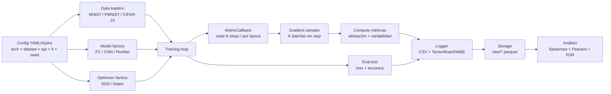

# Pipeline experimental

Descripción operativa del pipeline que entrena los modelos del TFG y loggea las métricas tempranas de gradiente para el análisis correlacional posterior. Consolidación de las decisiones de [[Estado TFG]], [[metrics]], [[models]], [[datasets]] y las secciones `## Medición y pipeline` de los 15 papers.

## Objetivo

Generar, por cada run `(arquitectura, dataset, optimizador, lr, seed)`:

1. Trayectoria completa de **métricas tempranas de gradiente** (alineación + variabilidad) a lo largo del entrenamiento.
2. Trayectoria de **indicadores de eficiencia** (loss train/test, accuracy, épocas hasta umbral, AUC test loss, best test loss).
3. Metadatos reproducibles (config, seed, versión de código, hardware).

Salida final: dataset tabular `runs × (métrica temprana × ventana) × indicadores de eficiencia` apto para Spearman/Pearson + FDR.

## Visión general



## Componentes

### Config

YAML + Hydra. Un run = una composición.

```yaml
run:
  seed: 42
  budget_epochs: 100
dataset:
  name: cifar10        # mnist | fashion_mnist | cifar10
  batch_size: 128
model:
  arch: resnet18       # fc | cnn_small | resnet18
optimizer:
  name: sgd            # sgd | adam
  lr: 0.1
  momentum: 0.9        # solo SGD
metrics:
  cadence_steps: 200   # cada cuántos steps medir
  k_batches: 8         # batches extra para muestreo de gradiente
  probe_size: 256      # ejemplos para per-sample (stiffness, GSNR, NTK)
  enabled:
    - cos_sim_batches
    - gradient_disparity
    - m_coherence
    - normalized_variance
    - gns_simple
    - gwa
    - tse
    # caras (off por defecto en pilot):
    - gradient_confusion
    - stiffness
    - gsnr
    - ntk_alignment
windows: [0.05, 0.10, 0.25, 0.50]
threshold_accuracy: 0.90   # primaria, VD1
```

### Datasets

Núcleo: MNIST, Fashion-MNIST, CIFAR-10 (decisión cerrada en [[Estado TFG]]). Loaders deterministas con `seed` fija. Splits estándar. Normalización por dataset. Sin augmentation para el pilot (introducirla solo si la robustez lo exige).

### Modelos

Tres familias según [[models]]:

- **FC**: MLP `784 → 512 → 256 → C` (MNIST/FMNIST), `3072 → 512 → 256 → 10` (CIFAR-10).
- **CNN pequeña**: 3 bloques Conv-ReLU-MaxPool + FC.
- **ResNet-18**: implementación estándar, sin pretraining.

Factory devuelve modelo + lista de parámetros con nombre por capa (necesario para métricas per-layer).

### Optimizadores

SGD (con momentum 0.9) y Adam (β₁=0.9, β₂=0.999, ε=1e-8). Las métricas se calculan sobre el **gradiente crudo** ∇L(w), no sobre el update preacondicionado de Adam — decisión justificada en [[Adam - A Method for Stochastic Optimization]] para mantener comparabilidad cross-optimizador.

### Training loop

```python
for epoch in range(cfg.run.budget_epochs):
    for step, batch in enumerate(train_loader):
        loss = forward(model, batch)
        loss.backward()
        optimizer.step()
        optimizer.zero_grad()
        log_train_step(loss, lr_effective)

        if global_step % cfg.metrics.cadence_steps == 0:
            with frozen_params(model):
                metrics = compute_gradient_metrics(model, train_loader_sampler, cfg)
                logger.log(metrics, step=global_step)

    test_loss, test_acc = evaluate(model, test_loader)
    logger.log({"test_loss": test_loss, "test_acc": test_acc}, step=epoch)
    if test_acc >= cfg.threshold_accuracy and epochs_to_threshold is None:
        epochs_to_threshold = epoch
```

`frozen_params` guarda y restaura el estado del optimizador para que la medición no contamine el entrenamiento.

### Sampler de gradiente

Función central reutilizada por casi todas las métricas:

```python
def sample_batch_gradients(model, loader, K, device):
    grads = []
    for k in range(K):
        x, y = next(loader)
        model.zero_grad()
        loss = criterion(model(x.to(device)), y.to(device))
        loss.backward()
        g = torch.cat([p.grad.detach().flatten() for p in model.parameters() if p.grad is not None])
        grads.append(g)
    model.zero_grad()
    return torch.stack(grads)  # [K, P]
```

Para métricas per-example (stiffness, GSNR, NTK): `torch.func.vmap(torch.func.grad(loss_fn))` sobre `probe_size` ejemplos.

### Métricas

Dos familias confirmadas en [[Estado TFG]]. Tabla con coste relativo y referencia a la sección `## Medición y pipeline` del paper correspondiente.

| Métrica | Familia | Coste | Estimador | Paper |
|---------|---------|-------|-----------|-------|
| cos_sim_batches | alineación | bajo | `mean cos(g_i, g_j)` sobre K batches | [[Disparity Between Batches as a Signal for Early Stopping]] |
| gradient_disparity | alineación | bajo | `mean ||g_i - g_j||_2` | [[Disparity Between Batches as a Signal for Early Stopping]] |
| m_coherence | alineación | bajo (streaming O(P)) | `||Σ g_i||² / (m · Σ ||g_i||²)` | [[Making Coherence Out of Nothing At All - Measuring the Evolution of Gradient Alignment]] |
| gradient_confusion | alineación | alto (O(M²)) | `min_{i≠j} cos(∇f_i, ∇f_j)` | [[The Impact of Neural Network Overparameterization on Gradient Confusion and Stochastic Gradient Descent]] |
| stiffness | alineación | medio-alto | `E[sign(g_a·g_b)]`, `E[cos(g_a,g_b)]` per-sample | [[Stiffness - A New Perspective on Generalization in Neural Networks]] |
| gwa | alineación | nulo (reutiliza grad) | `cos(∇L, w)` per-layer | [[Gradient-Weight Alignment as a Train-Time Proxy for Generalization in Classification Tasks]] |
| normalized_variance | variabilidad | medio | `tr(Cov(g)) / ||E[g]||²` streaming | [[A Study of Gradient Variance in Deep Learning]] |
| gns_simple | variabilidad | bajo | two-batch estimator (B_small, B_big) | [[An Empirical Model of Large-Batch Training]] |
| gsnr | variabilidad | alto (per-sample) | `μ_j² / σ_j²` por parámetro, agregado | [[Understanding Why Neural Networks Generalize Well Through GSNR of Parameters]] |
| ntk_alignment | alineación | alto (N²) | `⟨K, yy^T⟩_F / (||K||_F · ||yy^T||_F)` | [[A Theory of Neural Tangent Kernel Alignment and Its Influence on Training]] |
| tse | baseline | nulo (reutiliza loss) | `Σ_t L_train_t` + EMA | [[Speedy Performance Estimation for Neural Architecture Search]] |

**Decisión de pilot**: arrancar con las baratas (cos_sim, disparity, m_coherence, normalized_variance, gns_simple, gwa, tse). Caras (gradient_confusion, stiffness, gsnr, ntk_alignment) se incorporan tras medir overhead real — riesgo #2 de [[Estado TFG]].

**Granularidad**: cada métrica se loggea como escalar global **y** por capa cuando es barato (m_coherence, gwa, normalized_variance). Per-layer enriquece el análisis sin coste extra significativo.

### Indicadores de eficiencia (VD)

Loggeados por cada run, derivados de la curva test:

- **VD1 (primaria)**: `epochs_to_threshold` — primera época con `test_acc ≥ τ`. Censurado si no se alcanza.
- **VD2**: `auc_test_loss` — integral de la curva test loss sobre el presupuesto.
- **VD3**: `best_test_loss` — mínimo test loss alcanzado.

Umbral τ por dataset:
- MNIST: 0.98
- Fashion-MNIST: 0.90
- CIFAR-10: 0.85

(Calibrar en pilot.)

### Logging

Stack: **W&B** (cloud, gratis para académico) + dump local en **Parquet** para análisis offline.

Eventos:
- `step`: `train_loss`, `lr_effective`, métricas baratas (cos_sim, gwa, disparity).
- `epoch`: `test_loss`, `test_acc`, métricas medio-caras (m_coherence, normalized_variance, gns_simple, tse acumulado).
- `every_K_epochs`: métricas caras (stiffness, gsnr, ntk_alignment, gradient_confusion).

Esquema tabular final por run (parquet):

```
run_id | step | epoch | metric_name | layer | value
```

Más una tabla `runs.parquet` con metadatos + VDs por run.

### Storage

```
experiments/
  raw/
    <run_id>/
      metrics.parquet
      config.yaml
      git_sha.txt
  processed/
    runs.parquet                  # un row por run, VDs + metadata
    metrics_at_window.parquet     # un row por (run, métrica, ventana)
```

`metrics_at_window`: para cada ventana w ∈ {5%, 10%, 25%, 50%} y cada métrica m, se calcula el agregado (media, último valor, AUC parcial) restringido a los primeros `w · budget_epochs`. Esto es la matriz de features para el análisis.

## Análisis post-training

Script offline, no es parte del pipeline de entrenamiento.

1. Cargar `metrics_at_window.parquet` + `runs.parquet`.
2. Por celda `(arch × dataset × optimizador)`:
   - Spearman ρ entre cada métrica@ventana y cada VD.
   - Pearson r idem (secundaria).
3. Aplicar Benjamini-Hochberg sobre el conjunto de p-values (FDR 5%).
4. Reportar también correlaciones no significativas (decisión de [[Estado TFG]] — evita p-hacking).
5. Análisis de robustez: estabilidad de ρ across condiciones.

## Pseudocódigo principal

```python
def run_experiment(cfg):
    set_seed(cfg.run.seed)
    model = build_model(cfg.model).to(device)
    train_loader, test_loader = build_loaders(cfg.dataset)
    optimizer = build_optimizer(model, cfg.optimizer)
    logger = Logger(cfg)

    metric_fns = {name: METRIC_REGISTRY[name](cfg) for name in cfg.metrics.enabled}
    global_step = 0
    epochs_to_threshold = None

    for epoch in range(cfg.run.budget_epochs):
        model.train()
        for x, y in train_loader:
            loss = criterion(model(x.to(device)), y.to(device))
            optimizer.zero_grad()
            loss.backward()
            optimizer.step()
            logger.log_step({"train_loss": loss.item()}, global_step)

            if global_step % cfg.metrics.cadence_steps == 0:
                snapshot = clone_state(model, optimizer)
                grads = sample_batch_gradients(model, train_loader, cfg.metrics.k_batches)
                for name, fn in metric_fns.items():
                    if fn.cadence == "step":
                        logger.log_step({name: fn(model, grads)}, global_step)
                restore_state(model, optimizer, snapshot)

            global_step += 1

        test_loss, test_acc = evaluate(model, test_loader)
        logger.log_epoch({"test_loss": test_loss, "test_acc": test_acc}, epoch)
        if test_acc >= cfg.threshold_accuracy and epochs_to_threshold is None:
            epochs_to_threshold = epoch

        for name, fn in metric_fns.items():
            if fn.cadence == "epoch":
                grads = sample_batch_gradients(model, train_loader, cfg.metrics.k_batches)
                logger.log_epoch({name: fn(model, grads)}, epoch)

    logger.finalize({
        "epochs_to_threshold": epochs_to_threshold,
        "auc_test_loss": logger.compute_auc("test_loss"),
        "best_test_loss": logger.best("test_loss"),
    })
```

Cada métrica vive en `METRIC_REGISTRY` como clase con `.cadence` y `.__call__(model, grads)`. Aislamiento → añadir o remover métricas no toca el loop.

## Riesgos y decisiones

- **Coste de métricas caras**: gradient_confusion (O(M²)), stiffness (O(N²)), GSNR/NTK (per-sample + N²). Medir overhead en pilot MNIST × FC × SGD antes de extrapolar. Si overhead > 50% del tiempo de step → relegar a `every_K_epochs` o eliminar.
- **Snapshot/restore del optimizador**: PyTorch `optimizer.state_dict()` + `model.state_dict()` antes de muestrear gradientes, restaurar después. Imprescindible para Adam (m_t, v_t cambian con cada backward).
- **BN/Dropout en muestreo**: usar `model.eval()` durante medición para consistencia; restaurar `model.train()` después.
- **Determinismo**: `torch.use_deterministic_algorithms(True)`, `cudnn.deterministic = True`, seeds fijas por componente (data, model init, batch sampler).
- **Censura en VD1**: runs que no alcanzan τ son `NaN` en `epochs_to_threshold` — Spearman maneja censura con tratamiento explícito (e.g. `epochs_to_threshold = budget` como rank máximo).

## Stack

- **PyTorch 2.x** + **torch.func** (vmap, grad) para per-sample.
- **Hydra** para config.
- **W&B** para logging online + **PyArrow** para parquet local.
- **Pandas/Polars** + **scipy.stats** + **statsmodels** (multipletests BH) para análisis.

## Próximos pasos

Alineados con [[Estado TFG]] — pasos 1-8:

1. Cerrar lista definitiva de métricas (preregistro).
2. Budget de cómputo total: `|arch| × |dataset| × |opt| × |lr| × n_seeds ≥ 30 por celda`. Si no cuadra → recortar antes de empezar.
3. Implementar `METRIC_REGISTRY` con las baratas primero.
4. Pilot: MNIST × FC × SGD × 3 LRs × 5 seeds. Validar logging, overhead, storage.
5. Decidir inclusión de métricas caras según overhead medido en pilot.
6. Ejecutar grid completo.
7. Análisis Spearman + Pearson + FDR.
8. Memoria.

## Related

- [[Estado TFG]]
- [[Planificacion TFG]]
- [[metrics]]
- [[models]]
- [[datasets]]
- [[Bachelor's Thesis]]
